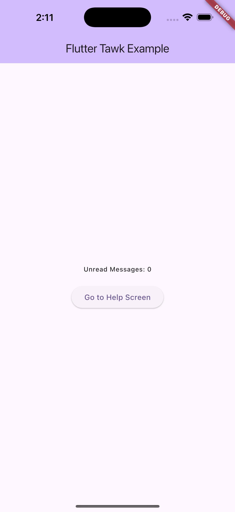
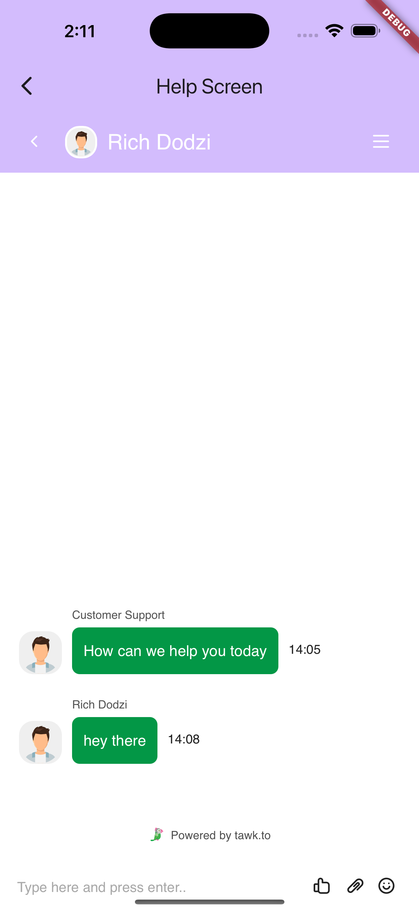

# flutter_tawk

A Flutter package for integrating [Tawk.to](https://www.tawk.to/) live chat functionality into your Flutter applications. This package provides a seamless way to embed a Tawk.to chat widget, manage visitor attributes, handle agent messages, and display notifications using a WebView-based interface.

## Features

- **Seamless Tawk.to Integration**: Embeds the Tawk.to chat widget using `flutter_inappwebview` for a smooth in-app chat experience.
- **Customizable Visitor Attributes**: Set visitor details such as name, email, and custom attributes, with optional secure hash authentication.
- **Real-Time Agent Message Handling**: Receive and process messages from Tawk.to agents via an event bus.
- **Local Notifications**: Display notifications for incoming agent messages, with customizable notification settings.
- **Background Support**: Run the Tawk.to chat in the background for continuous operation to ensure users can receive messages even when the app is not in the foreground.
- **Customizable UI**: Display a placeholder widget (e.g., a loading indicator) while the chat loads.

## Getting Started

### Prerequisites

- **Flutter SDK**: Version 3.6.0 or higher.
- **Dart SDK**: Compatible with Flutter SDK requirements.
- **Tawk.to Account**: A valid Tawk.to account with a chat widget URL (direct chat link).

### Installation

1. Add the package to your `pubspec.yaml`:
   ```yaml
   dependencies:
     flutter_tawk: ^0.0.1
   ```

2. Run the following command to install the package:
   ```bash
   flutter pub get
   ```

3. Import the package in your Dart code:
   ```dart
   import 'package:flutter_tawk/flutter_tawk.dart';
   ```

## Usage

### Initializing the Tawk.to Service

To use the `flutter_tawk` package, initialize the `TawkService` with a direct chat link and optional visitor attributes. The service can be initialized in the `main.dart` file or another appropriate entry point.

```dart
import 'package:flutter_tawk/flutter_tawk.dart';

void main() {
  WidgetsFlutterBinding.ensureInitialized();
  TawkNotificationService().initialize(); // Initialize notifications
  runApp(const MyApp());
}

// Initialize TawkService in a notification service or main function
TawkService().initialize(
  directChatLink: 'https://tawk.to/chat/your_chat_id/your_widget_id',
  visitor: TawkVisitor(
    name: 'John Doe', // Optional
    email: 'john@example.com', // Optional
    secret: 'your_tawk_secret_key', // Optional for secure hash
    otherAttributes: { // Optional
      'user-id': '12345',
      'phone-number': '+1234567890',
    },
  ),
  onAgentMessage: (message) {
    print('Agent message: $message');
  },
  onLoad: () {
    print('Tawk.to chat loaded');
  },
  onLinkTap: (url) {
    print('External link tapped: $url');
  },
);
```

### Embedding the Chat Widget

Use the `TawkService().getWebViewWidget` method to embed the Tawk.to chat widget in your app's UI.

```dart
Scaffold(
  appBar: AppBar(title: Text('Help Center')),
  body: TawkService().getWebViewWidget(
    placeholder: Center(child: CircularProgressIndicator()),
  ),
)
```

### Handling Notifications

The `TawkNotificationService` initializes and handles incoming agent messages and displays them as local notifications. You can integrate with your state management to provide unread message counts, etc.

```dart
class TawkNotificationService {
  static final TawkNotificationService _instance = TawkNotificationService._internal();
  factory TawkNotificationService() => _instance;
  TawkNotificationService._internal();

  final FlutterLocalNotificationsPlugin _notificationsPlugin = FlutterLocalNotificationsPlugin();

  Future<void> initialize() async {
    const initializationSettings = InitializationSettings(
      android: AndroidInitializationSettings('@mipmap/ic_launcher'),
      iOS: DarwinInitializationSettings(
        requestAlertPermission: true,
        requestBadgePermission: true,
        requestSoundPermission: true,
      ),
    );

    await _notificationsPlugin.initialize(
      initializationSettings,
      onDidReceiveNotificationResponse: (response) {
        Get.find<GlobalStateController>().unreadMessages.value = 0;
        Get.to(() => HelpScreen());
      },
    );

    eventBus.on<AgentMessageEvent>().listen((event) {
      _showNotification(event.message);
      Get.find<GlobalStateController>().unreadMessages.value++;
    });
  }

  Future<void> _showNotification(String message) async {
    const androidDetails = AndroidNotificationDetails(
      'tawk_channel',
      'Alert',
      channelDescription: 'This channel is responsible for all the local notifications',
      playSound: true,
      importance: Importance.max,
      priority: Priority.high,
      icon: '@mipmap/ic_launcher',
    );
    const platformDetails = NotificationDetails(android: androidDetails);
    await _notificationsPlugin.show(
      0,
      'Tawk Support',
      message,
      platformDetails,
    );
  }
}
```

### Attributes for TawkVisitor

The `TawkVisitor` class allows you to set visitor information for the Tawk.to chat.

| Attribute         | Type                    | Description                                                                 | Mandatory |
|-------------------|-------------------------|-----------------------------------------------------------------------------|-----------|
| `name`            | `String?`               | The visitor's name displayed in the chat.                                   | Optional  |
| `email`           | `String?`               | The visitor's email address for identification.                             | Optional  |
| `secret`          | `String?`               | Secret key for generating a secure hash for authentication.                 | Optional  |
| `otherAttributes` | `Map<String, dynamic>?` | Additional custom attributes (e.g., user ID, phone number) to pass to Tawk.to. | Optional  |

Example:
```dart
TawkVisitor(
  name: 'John Doe',
  email: 'john@example.com',
  secret: 'your_tawk_secret_key',
  otherAttributes: {
    'user-id': '12345',
    'phone-number': '+1234567890',
  },
)
```

### Configuration Options for TawkService.initialize

| Parameter                | Type                 | Description                                                                 | Mandatory |
|--------------------------|----------------------|-----------------------------------------------------------------------------|-----------|
| `directChatLink`         | `String`             | The Tawk.to chat widget URL (e.g., `https://tawk.to/chat/...`).             | Mandatory |
| `visitor`                | `TawkVisitor?`       | Visitor details to set Tawk.to attributes.                                   | Optional  |
| `maxChatCacheDuration`   | `int?`               | Duration for caching chat data (not currently used).                        | Optional  |
| `onLoad`                 | `Function?`          | Callback triggered when the WebView finishes loading.                       | Optional  |
| `onLinkTap`              | `Function(String)?`  | Callback for handling external link taps outside the Tawk.to domain.        | Optional  |
| `onAgentMessage`         | `Function(String)?`  | Callback for handling messages from Tawk.to agents.                         | Optional  |

## Screenshots

Below are example screenshots of the `flutter_tawk` package in action:

| Home Screen | Chat Screen                          | Notification                         |
|-------------|--------------------------------------|--------------------------------------|
|  |  |  |


## Example

For a complete example, check the `/example` folder in the package repository. It includes a full implementation with a home screen, chat screen, and notification handling.

```dart
// main.dart
void main() {
  WidgetsFlutterBinding.ensureInitialized();
  TawkNotificationService().initialize();
  runApp(const MyApp());
}

class MyApp extends StatelessWidget {
  const MyApp({super.key});

  @override
  Widget build(BuildContext context) {
    return GetMaterialApp(
      title: 'Flutter Tawk Demo',
      theme: ThemeData(
        colorScheme: ColorScheme.fromSeed(seedColor: Colors.deepPurple),
        useMaterial3: true,
      ),
      home: const MyHomePage(),
    );
  }
}
```

## Additional Information

- **Documentation**: For detailed API documentation, refer to the Dart documentation generated from the source code.
- **Contributing**: Contributions are welcome! Please submit pull requests or open issues on the [GitHub repository](https://github.com/dohji/flutter_tawk).
- **Issues**: Report bugs or feature requests on the [issue tracker](https://github.com/dohji/flutter_tawk/issues).
- **Support**: For questions or support, contact the maintainers via the GitHub repository or check the Tawk.to [documentation](https://www.tawk.to/knowledgebase/).

